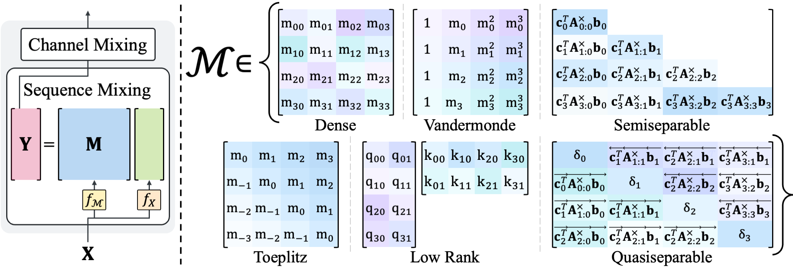

# Hydra


> **Hydra: Bidirectional State Space Models Through Generalized Matrix Mixers**\
> Sukjun Hwang*, Aakash Lahoti*, Tri Dao, Albert Gu\
> Paper: https://arxiv.org/abs/2407.09941 \
> Blogpost: https://goombalab.github.io/blog/2024/hydra-part1-matrix-mixer/

## About

## Installation
Follow the installation section of [Mamba](https://github.com/state-spaces/mamba); simply,
```bash
pip install mamba-ssm
```

[Option] For training BERT (`./hydra/bert`), install additional required packages via `pip install -r requirements.txt`

## Usage

### Hydra Block

The quasiseparable matrix mixer, ***Hydra***, is our best model for bidirectional sequence processing (details in Section 3).\
The implementation is at [./hydra/modules/hydra.py](./hydra/modules/hydra.py).

```python
import torch
from .hydra import Hydra

batch, length, dim = 2, 64, 16
x = torch.randn(batch, length, dim).to("cuda")
model = Hydra(
    d_model=dim, # Model dimension d_model
    d_state=64,  # SSM state expansion factor
    d_conv=7,    # Local non-causal convolution width
    expand=2,    # Block expansion factor
    use_mem_eff_path=False,    # Nightly release. Thanks to Alston Lo
).to("cuda")
y = model(x)
assert y.shape == x.shape
```

### Matrix Mixer Block

The matrix mixer framework is implemented at [./hydra/modules/matrix_mixer.py](./hydra/modules/matrix_mixer.py).\
You can easily integrate your own mixer matrix by following our implementations of various sequence mixers located at [./hydra/modules/matrix_mixers/](./hydra/modules/matrix_mixers/)!

```python
from .hydra import MatrixMixer

model = MatrixMixer(
    """
    matrix_mixer_type: options for matrix_mixer_type
        {'dense', 'toeplitz', 'vandermonde', 'cauchy', 'low_rank', 'attention', 'quasiseparable'}
    is_data_dependent: boolean flag to parameterize the mixer matrix to SAM
    """
    matrix_mixer_type=matrix_mixer_type,
    is_data_dependent=is_data_dependent,
    d_model=dim,    # Model dimension d_model
    qk_dim=qk_dim,  # dimension for QK
).to("cuda")
y = model(x)
assert y.shape == x.shape
```

### BERT

Our code for training BERT ([./hydra/bert/](./hydra/bert/)) is based on [MosaicBERT](https://github.com/mosaicml/examples/tree/main/examples/benchmarks/bert) and [M2](https://github.com/HazyResearch/m2).

Follow the instructions of MosaicBERT ([./hydra/bert/README.md](./hydra/bert/README.md)) for details (*e.g.*, setting up dataset and running code). \
The default configurations for Hydra and MatrixMixer are located at:
- Pretrain: [./hydra/bert/yamls/pretrain](./hydra/bert/yamls/pretrain)
- Finetune: [./hydra/bert/yamls/finetune](./hydra/bert/yamls/finetune)

#### Example commands:
Pretrain Hydra on C4 using a single GPU:
```bash
python main.py yamls/pretrain/hydra.yaml
```
Pretrain Hydra on C4 using 8 GPUs:
```bash
composer -n 8 main.py yamls/pretrain/hydra.yaml
```
Finetune Hydra on GLUE:
```bash
python glue.py yamls/finetune/hydra.yaml
```

### Pretrained Weights
Weights of Hydra with 23layers pretrained on C4 are uploaded to [HuggingFace](https://huggingface.co/goombalab/hydra).

## Acknowledgement
We thank the authors of [Mamba](https://github.com/state-spaces/mamba), [MosaicBERT](https://github.com/mosaicml/examples/tree/main/examples/benchmarks/bert), and [M2](https://github.com/HazyResearch/m2) for their wonderful codebases.

## Citation
If you use this codebase, or otherwise find our work valuable, please cite Hydra:
```
@article{hydra,
  title={Hydra: Bidirectional State Space Models Through Generalized Matrix Mixers},
  author={Hwang, Sukjun and Lahoti, Aakash and Dao, Tri and Gu, Albert},
  journal={arXiv preprint arXiv:2407.09941},
  year={2024}
}
```
